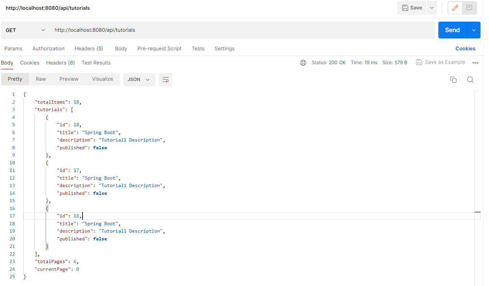
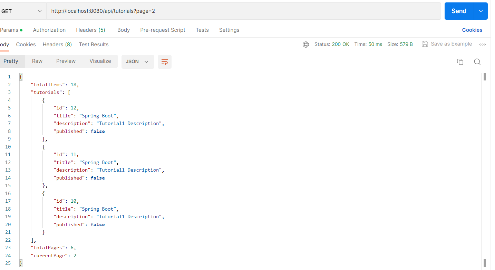
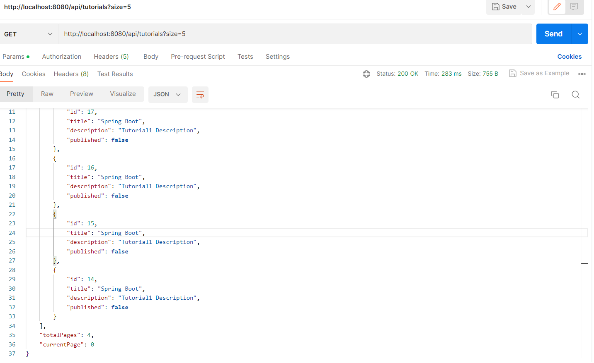

### Postman client response

- http://localhost:8080/api/tutorials

- http://localhost:8080/api/tutorials?page=2

-http://localhost:8080/api/tutorials?size=5

- http://localhost:8080/api/tutorials?page=1&size=5

- http://localhost:8080/api/tutorials?title=data&size=3
